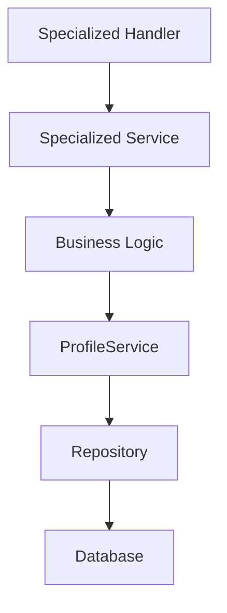

# BookIt API

## Build

```bash
GOOS=linux GOARCH=amd64 CGO_ENABLED=0 go build -o bootstrap *.go
```

## Description

BookIt is a serverless application for tracking your reading progress, managing your book lists, and participating in reading challenges.

- **Books**: Store and manage book metadata
- **Profiles**: Store user profile information and reading data
- **Authentication**: Secure user authentication using AWS Cognito
- **Lists**: Manage different reading lists (to-be-read, read, custom lists)
- **Currently Reading**: Track books you're currently reading
- **Reading Log**: Log your reading history
- **Challenges**: Set and track reading challenges

## Architecture

### Clean Architecture

BookIt follows clean architecture principles with clear separation of concerns:

#### 1. Domain Layer

- **Models**: Core business entities (Book, Profile, ReadingLog, etc.)
- Located in `pkg/models`

#### 2. Use Case Layer

- **Service Interfaces**: Define the operations for each domain
- Located in `pkg/usecase`
  - `BookService`: Book management
  - `ProfileService`: Profile data access
  - `CurrentlyReadingService`: Currently reading functionality
  - `ReadingListService`: List management
  - `ReadingLogService`: Reading log operations
  - `ReadingChallengeService`: Challenge management

#### 3. Interface Adapters

- **Handlers**: HTTP request handlers that call services
- Located in `pkg/delivery`
  - `BookHandler`: Book endpoints
  - `ProfileHandler`: Profile endpoints
  - `CurrentlyReadingHandler`: Currently reading endpoints
  - `ReadingListHandler`: List management endpoints
  - `ChallengeHandler`: Challenge endpoints
  - `ReadingLogHandler`: Reading log endpoints
- **Repositories**: Data access implementations
- Located in `pkg/repository`
  - `dynamodb`: DynamoDB implementations

#### 4. Infrastructure

- AWS resources defined in `template.yaml`:
  - DynamoDB tables
  - Lambda functions
  - API Gateway
  - Cognito

### Data Flow

```mermaid
HTTP Request → API Gateway → Lambda → Router → Handler → Service → Repository → DynamoDB
                                                           ↑
                                                           |
                                                        Models
```

### Service Architecture

Each domain has a dedicated service and handler:

```ascii
┌─────────────────┐     ┌─────────────────┐     
│  BookHandler    │     │  BookService    │     
│                 │────▶│                 │────▶
└─────────────────┘     └─────────────────┘     

┌─────────────────┐     ┌─────────────────┐     
│ ProfileHandler  │     │ ProfileService  │     
│                 │────▶│                 │────▶
└─────────────────┘     └─────────────────┘     
                                                
┌─────────────────┐     ┌─────────────────┐     
│ CurrentlyReading│     │ CurrentlyReading│     
│ Handler         │────▶│ Service         │────▶
└─────────────────┘     └─────────────────┘     
                                                
┌─────────────────┐     ┌─────────────────┐     
│ ReadingList     │     │ ReadingList     │     
│ Handler         │────▶│ Service         │────▶
└─────────────────┘     └─────────────────┘     
                                                
┌─────────────────┐     ┌─────────────────┐     
│ Challenge       │     │ Reading         │     
│ Handler         │────▶│ ChallengeService│────▶
└─────────────────┘     └─────────────────┘     
                                                
┌─────────────────┐     ┌─────────────────┐     
│ ReadingLog      │     │ ReadingLog      │     
│ Handler         │────▶│ Service         │────▶
└─────────────────┘     └─────────────────┘     
```

**Key Service Responsibilities:**

- **ProfileService**: Provides basic CRUD operations for profile data without specialized business logic. Acts as a data access layer for the profile entity, which is the root-level entity containing reading lists, currently reading data, reading logs, and challenges.

- **BookService**: Manages book metadata and provides book-related business logic.

- **Specialized Services**: Each specialized service (CurrentlyReadingService, ReadingListService, etc.) implements business logic specific to its domain and uses ProfileService to access/modify the profile data when needed.

**Data Flow for Profile Updates:**



The relationship is hierarchical - specialized services may use ProfileService to persist their data, but ProfileService is not aware of the specialized services and only provides basic data access operations.

### Database Structure

BookIt uses two main DynamoDB tables:

1. **BooksTable**: Stores book metadata
   - Primary Key: `bookId`
   - GSIs:
     - `TitleIndex`: Search by title
     - `ISBNIndex`: Search by ISBN
     - `OpenLibraryIndex`: Search by OpenLibrary ID

2. **ProfilesTable**: Stores user profiles and all reading data
   - Primary Key: `_id` (user's Cognito sub)
   - Contains embedded objects:
     - `profileInformation`: Basic user info
     - `currentlyReading`: Books being read
     - `lists`: All reading lists (to-be-read, read, custom)
     - `readingLog`: Reading activity history
     - `challenges`: Reading challenges

## Deployment

1. Build the application:

   ```bash
   sam build
   ```

2. Deploy:

   ```bash
   sam deploy --guided
   ```

## Local Development

1. Set environment variables in `dev-env.json`
2. Run:

   ```bash
   sam local start-api --env-vars dev-env.json
   ```
